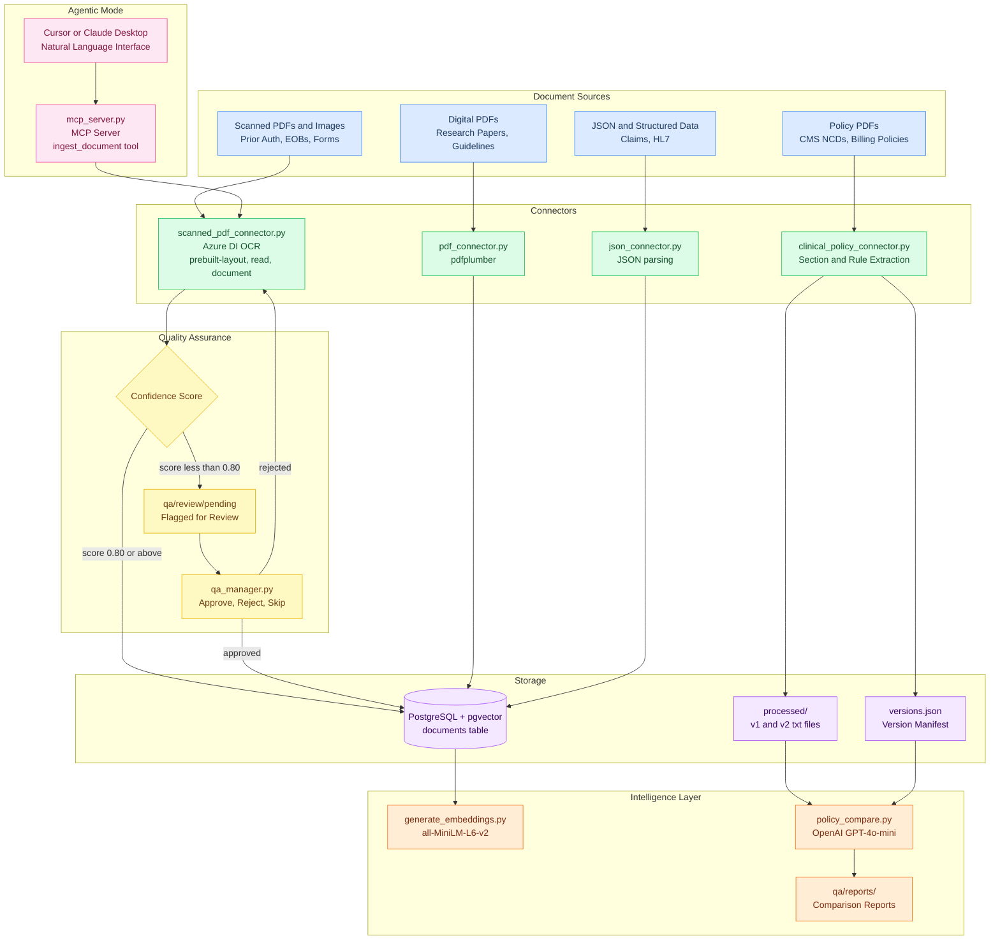

# Clinical Document Pipeline

A modular, multi-source clinical document intelligence pipeline designed for healthcare organization workflows. The system ingests scanned forms, digital PDF documents, and structured data through swappable OCR connectors, enabling flexible document processing across varied input formats. It also supports policy document version tracking and LLM-assisted analysis to identify coverage changes, assess operational impact, and route findings for human review.

The project is intended to demonstrate the foundational infrastructure of clinical natural language technology, integrating OCR, NLP, and LLM capabilities within a unified pipeline architecture. In the context of accuracy, it shows how document ingestion, information extraction, and policy intelligence can be combined to support scalable, auditable, and operationally relevant workflows.

---

## Overview

Healthcare organizations process thousands of clinical documents daily - prior authorization forms, explanation of benefits (EOBs), discharge summaries, and billing policy documents. These documents arrive in inconsistent formats, many as scanned PDFs, and contain policy rules that change frequently.

This pipeline addresses three core problems:

- **Ingestion**: Extract text from scanned and digital clinical documents using interchangeable OCR backends allowing the most appropriate provider to be selected for each use case.
- **Policy Intelligence**: Track versions of billing and coding policy documents and detect what changed between versions using LLM analysis.
- **Quality Assurance**: Automatically flag low confidence extractions for human review before they enter downstream workflows.

---

## Architecture

---

## Features

- **Interchangeable OCR backends**: Switch between Azure Document Intelligence models (`prebuilt-read`, `prebuilt-layout`, `prebuilt-document`) via a single CLI flag without changing downstream logic
- **Confidence scoring**: Word-level confidence extracted per document chunk; low-confidence documents automatically routed to QA review queue
- **Interactive QA review**: Terminal based review manager with approve/reject/skip workflow and audit log
- **Policy version tracking**: `versions.json` manifest tracks multiple versions of any policy document group
- **LLM policy comparison**: OpenAI GPT-4o-mini compares two policy versions and returns structured analysis of what changed and operational impact
- **MCP server**: Exposes `ingest_document` as an MCP tool, enabling agentic workflows via Cursor or Claude Desktop
- **Vector embeddings**: `sentence-transformers` generates embeddings for semantic search over ingested documents

---

## Tech Stack
| Layer | Technology |
|---|---|
| OCR | Azure Document Intelligence (Form Recognizer) |
| Text extraction | pdfplumber, PyPDF2 |
| Database | PostgreSQL + pgvector (Docker) |
| Embeddings | sentence-transformers (all-MiniLM-L6-v2) |
| LLM analysis | OpenAI GPT-4o-mini |
| MCP server | Anthropic MCP SDK (stdio transport) |
| Pipeline orchestration | Python |
| Containerization | Docker Compose |

---

## Project Structure

```
docsync/
├── connectors/
│   ├── scanned_pdf_connector.py       # OCR ingestion with confidence scoring + QA routing
│   ├── pdf_connector.py               # Digital PDF ingestion
│   ├── json_connector.py              # JSON / structured data ingestion
│   └── clinical_policy_connector.py   # Policy document ingestion + version registration
│
├── analysis/
│   ├── policy_compare.py              # LLM-powered policy version comparison
│   └── version_store.py               # Policy version tracking and manifest management
│
├── mcp_server/
│   └── mcp_server.py                  # MCP server exposing ingest_document tool
│
├── qa/
│   ├── qa_manager.py                  # Interactive QA review manager
│   └── review/
│       ├── pending/                   # Flagged documents awaiting review
│       ├── approved/                  # Cleared by human reviewer
│       ├── rejected/                  # Needs reprocessing
│       └── reports/                   # LLM policy comparison reports
│
├── samples/
│   ├── scanned/                       # Scanned PNG/PDF samples
│   ├── digital/                       # Digital PDF samples
│   ├── json/                          # JSON data samples
│   └── policy/
│       └── cms_ncd/
│           ├── raw/                   # Original PDFs
│           ├── processed/             # Extracted text by version label
│           └── versions.json          # Version manifest
│
├── generate_embeddings.py             # Embedding generation for semantic search
├── run_pipeline.py                    # Full pipeline demo script
├── docker-compose.yml                 # PostgreSQL + pgvector container
├── init.sql                           # Database schema
└── requirements.txt
```

---

## Getting Started

### Prerequisites

- Python 3.11+
- Docker Desktop
- Azure Document Intelligence resource (free tier works)
- OpenAI API key

### Installation

```bash
# Clone the repository
git clone https://github.com/Lahari-V03/clinical-doc-pipeline.git
cd clinical-doc-pipeline/docsync

# Create and activate virtual environment
python -m venv venv
venv\Scripts\activate  # Windows
source venv/bin/activate  # Mac/Linux

# Install dependencies
pip install -r requirements.txt

# Start PostgreSQL
docker-compose up -d
```

### Environment Variables

Create a `.env` file in `docsync/`:

```env
AZURE_DI_KEY=your_azure_document_intelligence_key
AZURE_DI_ENDPOINT=your_azure_document_intelligence_endpoint
OPENAI_API_KEY=your_openai_api_key
```

---

## Usage

### Running the Full Pipeline

```bash
python run_pipeline.py
```

Runs all connectors, policy ingestion, LLM comparison, and QA summary in sequence.

### Scanned Document Ingestion

```bash
# Plain scanned text (discharge summaries, clinical notes)
python connectors/scanned_pdf_connector.py --model prebuilt-read

# Forms with tables and checkboxes (prior auth, EOBs)
python connectors/scanned_pdf_connector.py --model prebuilt-layout

# Key-value structured forms (claims attachments)
python connectors/scanned_pdf_connector.py --model prebuilt-document
```

Documents scoring below `0.80` confidence are automatically routed to `qa/review/pending/`.

### Policy Ingestion and Version Tracking

```bash
# Ingest and register a policy document version
python connectors/clinical_policy_connector.py \
    --file samples/policy/cms_ncd/raw/2024-report-congress.pdf \
    --policy cms_ncd \
    --label v1 \
    --date 2024-08-01

# List all registered versions
python analysis/policy_compare.py --policy cms_ncd --list
```

### LLM Policy Comparison

```bash
# Compare last two registered versions automatically
python analysis/policy_compare.py --policy cms_ncd

# Compare specific versions
python analysis/policy_compare.py --policy cms_ncd --v1 v1 --v2 v2
```

Reports are saved to `qa/reports/`.

### QA Review Manager

```bash
python qa/qa_manager.py
```

Interactive terminal menu for reviewing flagged documents:
- `[a]` Approve - document cleared for pipeline
- `[r]` Reject - document needs reprocessing
- `[s]` Skip - review later

### MCP Server (Agentic Mode)

Add to `.cursor/mcp.json`:

```json
{
  "mcpServers": {
    "clinical-doc-pipeline": {
      "command": "path/to/venv/Scripts/python.exe",
      "args": ["path/to/docsync/mcp_server/mcp_server.py"]
    }
  }
}
```

Then in Cursor or Claude Desktop:
> *"Ingest the scanned clinical documents using the prebuilt-layout model"*

The agent automatically calls `ingest_document`, runs the OCR pipeline, and returns confidence scores and QA status.

---

## Known Limitations

- **Cell-level confidence not available** - Azure Document Intelligence SDK 3.3.x does not expose confidence scores on `DocumentTableCell`. Word-level confidence is used as a proxy. Cell-level confidence is available in the newer `azure-ai-documentintelligence` SDK and is planned as a future update.
- **Policy storage is file-based** - Extracted policy text is stored as `.txt` files in `processed/`. Production deployment would store in PostgreSQL with the `policy_versions` table for full audit trail.
- **OpenAI for LLM comparison** - The policy comparison uses OpenAI GPT-4o-mini. Production deployment would use Azure OpenAI within a HIPAA-compliant environment.
- **PHI handling** - This POC uses sample documents only. Real clinical documents containing PHI would require BAA agreements, data residency controls, and de-identification pipelines before processing through third-party APIs.

---

## Future Work

- Migrate policy storage to PostgreSQL `policy_versions` table
- Upgrade to `azure-ai-documentintelligence` SDK for cell-level confidence
- Add Azure OpenAI for HIPAA-compliant LLM comparison
- Extend MCP server with `compare_policies` and `get_qa_status` tools
- Add de-identification pipeline for PHI handling
- Build REST API (FastAPI) over the pipeline for integration with downstream systems

---

## License

This project is licensed under the MIT License. See [LICENSE](LICENSE) for details.

---

## Sample Data Sources

- **Handwritten form samples (FUNSD)** — Form Understanding in Noisy Scanned Documents dataset, cleaned version. Via [bernardadhitya/handwritten-form-ocr-ie-json-dataset](https://github.com/bernardadhitya/handwritten-form-ocr-ie-json-dataset/tree/main/Dataset/FUNSD_cleaned). Original paper: Jaume et al. (2019).
- **Handwritten sentence samples (IAM)** — IAM Handwriting Database. Via [bernardadhitya/handwritten-form-ocr-ie-json-dataset](https://github.com/bernardadhitya/handwritten-form-ocr-ie-json-dataset/tree/main/Dataset/IAM). Original dataset: Marti & Bunke (2002).
- **Policy documents** — CMS Medicare National Coverage Determinations Reports to Congress, FY2024 and FY2025. Centers for Medicare & Medicaid Services.
- **Research papers (digital PDF samples)** — Used as sample digital PDFs for the `pdf_connector`:
  - Liffiton, M., Sheese, B., Savelka, J., & Denny, P. (2023). CodeHelp: Using large language models with guardrails for scalable support in programming classes. *Proceedings of the 23rd Koli Calling International Conference on Computing Education Research*, 1–12. https://doi.org/10.1145/3631802.3631830
  - Devino, M., Ju, E., & Caldeira Junior, P. M. (2024). Designing and implementing LLM guardrails components in production environments. *IBM Research*. 

---

## References

- Jaume, G., Ekenel, H. K., & Thiran, J. P. (2019). FUNSD: A Dataset for Form Understanding in Noisy Scanned Documents. *ICDAR 2019*.
- Microsoft. (n.d.). Azure Document Intelligence documentation. https://learn.microsoft.com/en-us/azure/ai-services/document-intelligence/
- Google Cloud. (n.d.). Document AI documentation. https://cloud.google.com/document-ai/docs
- Centers for Medicare & Medicaid Services. (2025). Medicare National Coverage Determinations Report to Congress, Fiscal Year 2024. U.S. Department of Health and Human Services.
- Centers for Medicare & Medicaid Services. (2026). Medicare National Coverage Determinations Report to Congress, Fiscal Year 2025. U.S. Department of Health and Human Services.
- Anthropic. (2024). Model Context Protocol specification. https://modelcontextprotocol.io
